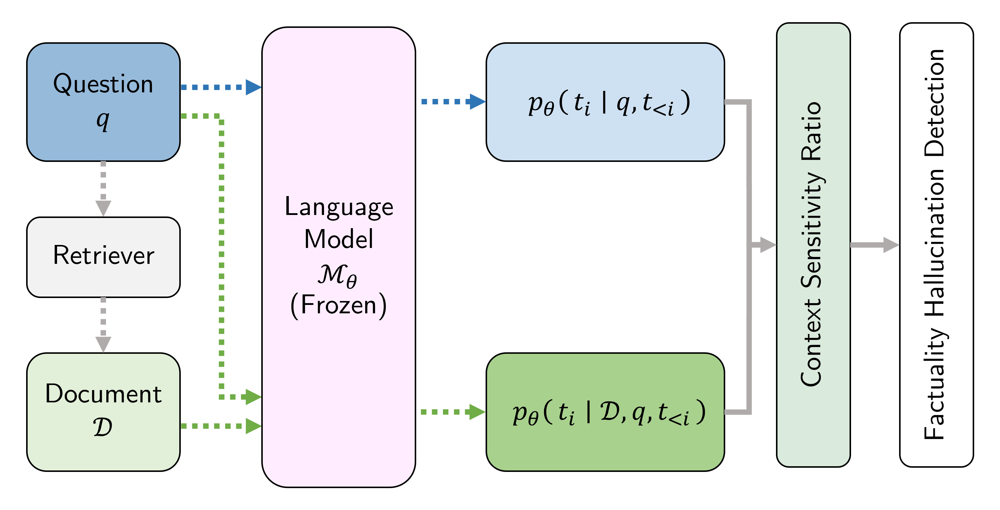

# REFIND: Retrieval Augmented Factual Hallucination Detection in Large Language Models

<div align="center">
    
</div>
<br>

## Task & Dataset Info.
[SemEval-2025 Task-3 — Mu-SHROOM](https://helsinki-nlp.github.io/shroom/)


## Usage
### Installation
```bash
conda create -n REFIND python=3.9
conda activate REFIND
pip install -r requirements.txt
python -m nltk.downloader punkt
python -m nltk.downloader punkt_tab
```

### Preparation
Download Mu-SHROOM Dataset from [Official Website](https://helsinki-nlp.github.io/shroom/#data) and put it in the [`data` directory](data/README.md).

```bash
# Retriever Preprocessing
sh scripts/preprocess_wiki.sh
```

### Experiment 
#### Validation Set
```bash
# Retrieve Contexts
sh scripts/run_val_retriever.sh

# Our Method
sh scripts/run_val_REFIND.sh

# Baselines
sh scripts/run_val_XLM-R.sh
sh scripts/run_val_FAVA.sh

## Evaluation
sh scripts/evaluate_val.sh
```

#### Test Set
```bash
# Retrieve Contexts
sh scripts/run_test_retriever.sh

# Our Method
sh scripts/run_test_REFIND.sh

# Baselines
sh scripts/run_test_XLM-R.sh
sh scripts/run_test_FAVA.sh

## Evaluation
sh scripts/evaluate_test.sh
```

## References
- [Official Website of Mu-SHROOM](https://helsinki-nlp.github.io/shroom/)
- [Official GitHub Repository of Mu-SHROOM](https://github.com/Helsinki-NLP/shroom)
- [Official Participant Kit of Mu-SHROOM](https://a3s.fi/mickusti-2007780-pub/participant_kit.zip)